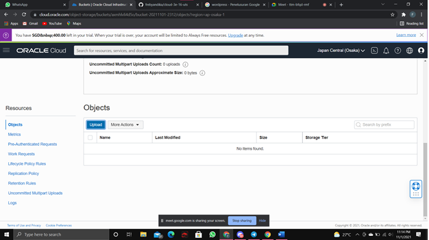
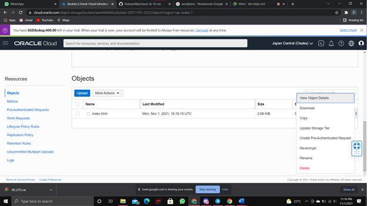

# 16 - UTS

## UTS Komputasi Awan

Untuk MK Komputasi Awan nanti tidak ada kelas daring & info dr Puskom portal/LMS sdg pemeliharaan server.
Agenda hari ini diganti UTS dg spesifikasi use case spt berikut:

Silakan masing-masing individu memanfaatkan object storage sebagai media penyimpanan assets (gambar, file2 upload, dsb) berdasarkan project Kuis 1 kemarin yaitu aplikasi Wordpress.
Sehingga hasil akhir utk UTS aplikasi dpt memanfaatkan VM, DB instance dan Object Storage.
Buatlah laporan di masing-masing repo private GitHub Anda!
Deadline 2 Nov 2021 Jam 07:00 WIB.

## Hasil UTS

## Upload file di wordpress
pertama login wordpress

